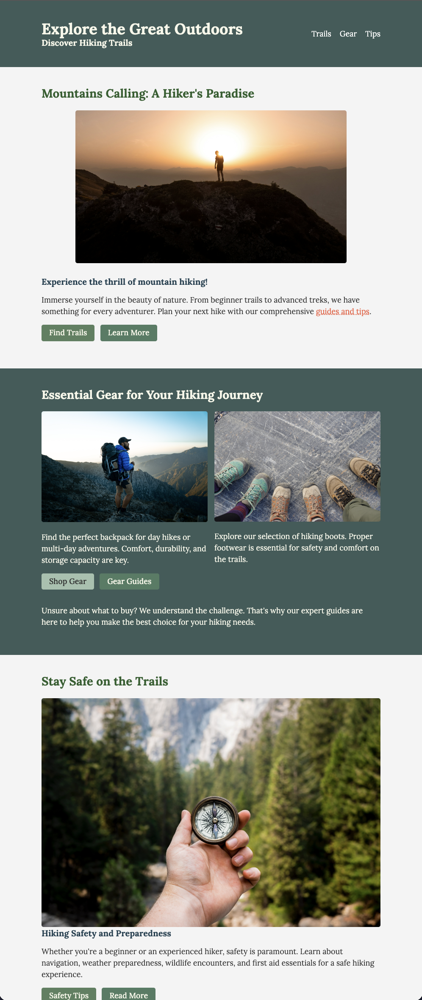

# Hiking Adventures Website

## Overview

Welcome to the repository for the Hiking Adventures website! This project is a static web page designed to offer information about hiking trails, gear, safety tips, and community events for hiking enthusiasts.

## Features

- **Responsive Design**: The website is fully responsive, ensuring a seamless experience across various devices.
- **Modern CSS Styling**: Utilizes CSS for aesthetic appeal, including custom fonts and button styling.
- **Hiking Information Sections**: Sections covering trails, gear, tips, and community engagement.

## Technology Stack

- HTML5
- CSS3
- External Libraries: Normalize.css, Google Fonts

## Quick Start

1. Clone the repository.
2. Open the `index.html` file in a web browser to view the website.

## File Structure

- `index.html` - The main HTML document.
- `index.css` - Styling for the website.
- `/images` - Directory containing images used in the website.

## Screenshots

## Contributing

Contributions to improve the website are welcome. Please follow these steps to contribute:
1. Fork the repository.
2. Create a new branch (`git checkout -b feature-branch`).
3. Make changes and commit (`git commit -am 'Add some feature'`).
4. Push to the branch (`git push origin feature-branch`).
5. Create a new Pull Request.

## Author
- This project was developed by - Mario Rodrigues Jr. - [MarioJr92](https://github.com/mariojr92)
